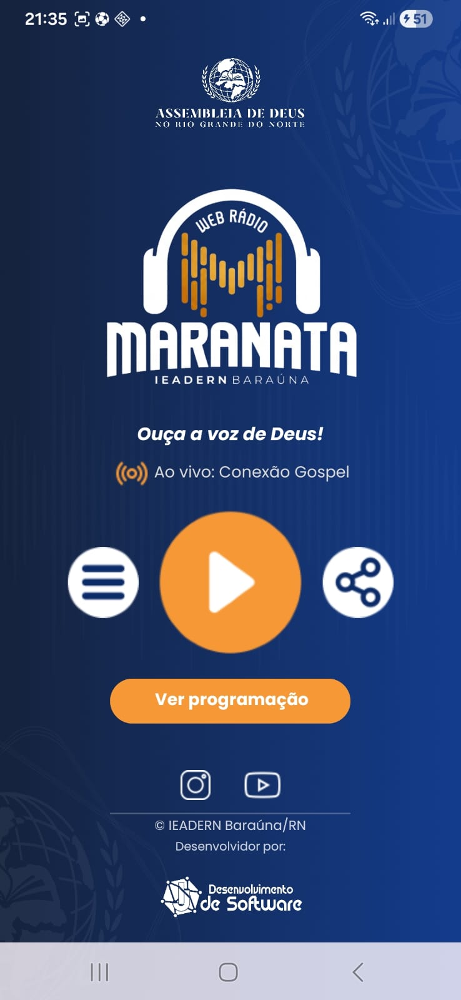
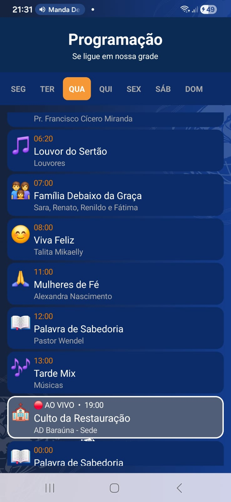
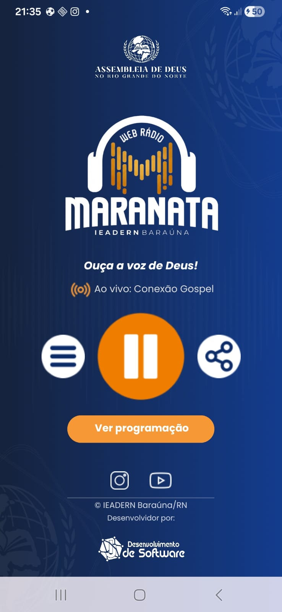

# 📻 Web Rádio 

<p align="center">
  
</p>

<p align="center">
  
  
  
  
</p>

---

## 📱 Telas do Aplicativo

<p align="center">
  
  &nbsp;&nbsp;
  
  &nbsp;&nbsp;
  
</p>

<p align="center">
  <em>Tela Principal &nbsp;&nbsp;&nbsp;&nbsp;&nbsp;&nbsp;&nbsp;&nbsp;&nbsp;&nbsp;&nbsp;&nbsp;&nbsp;&nbsp; Programação &nbsp;&nbsp;&nbsp;&nbsp;&nbsp;&nbsp;&nbsp;&nbsp;&nbsp;&nbsp;&nbsp;&nbsp;&nbsp;&nbsp; Programa Ao Vivo</em>
</p>

---

## ✨ Funcionalidades

### 🎵 Player de Rádio
- Transmissão ao vivo em stream MP3 de baixa latência
- Botão Play/Pause funcional
- Reprodução em segundo plano com a tela apagada
- App abre silencioso — toca somente quando o usuário apertar Play

### 🔔 Notificação
- Controles de Play, Pause e Stop na barra de notificações
- Funciona na tela de bloqueio via MediaSession
- Texto dinâmico: "🔴 Tocando ao vivo!" e "⏸ Pausado"
- Sincronização em tempo real entre notificação e app via BroadcastReceiver

### 🔊 Gerenciamento de Áudio (Audio Focus)
- Pausa automática durante ligações telefônicas
- Retoma automaticamente após ligação terminar
- Pausa ao gravar vídeo no app nativo e no WhatsApp
- Compatibilidade com MIUI (Xiaomi/Redmi)
- Volume adaptativo para áudios externos

### 📅 Programação
- Grade completa de Segunda a Domingo
- Navegação por abas com deslize lateral
- Cards com horário, nome, descrição e emoji de cada programa
- Destaque em tempo real para o programa que está **🔴 AO VIVO**
- Lógica inteligente para horários de meia-noite (00:00)

### 📋 Menu
- Sobre a Rádio
- Onde Estamos (Google Maps)
- Avaliar App (Play Store)
- Ajuda via WhatsApp
- Política de Privacidade
- Termos de Uso
- Informações do Sistema

### 📤 Outras Funcionalidades
- Compartilhamento do app via WhatsApp, Facebook, Email e outros
- Links diretos para Instagram e YouTube da rádio
- Splash Screen com identidade visual da rádio
- SafeArea — respeita barra de status e barra de navegação
- Fontes personalizadas Poppins (Regular, Bold, SemiBold, BoldItalic)
- Rodapé com © IEADERN Baraúna/RN e logo do desenvolvedor

---

## 🏗️ Arquitetura e Tecnologias

### Kotlin Multiplatform (KMP)
O projeto utiliza **Kotlin Multiplatform** com estrutura preparada para expansão multiplataforma:

```
WebRadio/
├── app/                          # Módulo Android principal
│   └── src/main/java/
│       └── com.adbarauna.webradio/
│           ├── MainActivity.kt        # Tela principal
│           ├── ProgramacaoActivity.kt # Tela de programação
│           ├── ProgramacaoAdapter.kt  # Adapter dos cards
│           ├── RadioService.kt        # Serviço de streaming
│           └── SplashActivity.kt      # Tela de abertura
├── shared/                       # Código compartilhado KMP
│   ├── androidMain/
│   ├── commonMain/
│   └── iosArm64Main/
└── res/
    ├── font/                     # Fontes Poppins
    ├── layout/                   # Layouts XML
    ├── drawable/                 # Ícones e backgrounds
    └── values/                   # Temas e strings
```

### Principais Dependências
| Biblioteca | Uso |
|---|---|
| **Media3 / ExoPlayer** | Streaming de áudio ao vivo |
| **MediaSession** | Controles na tela de bloqueio |
| **ViewPager2** | Navegação entre dias da programação |
| **RecyclerView** | Lista de programas |
| **LocalBroadcastManager** | Sincronização notificação ↔ app |
| **Poppins (Google Fonts)** | Tipografia do app |

---


## 📝 Licença

Este projeto foi desenvolvido por **Adson Vinicius**.  
Todos os direitos reservados © 2026.

---

## 👨‍💻 Desenvolvedor

**Adson Vinicius**  
📱 (84) 99212-9388  

---
